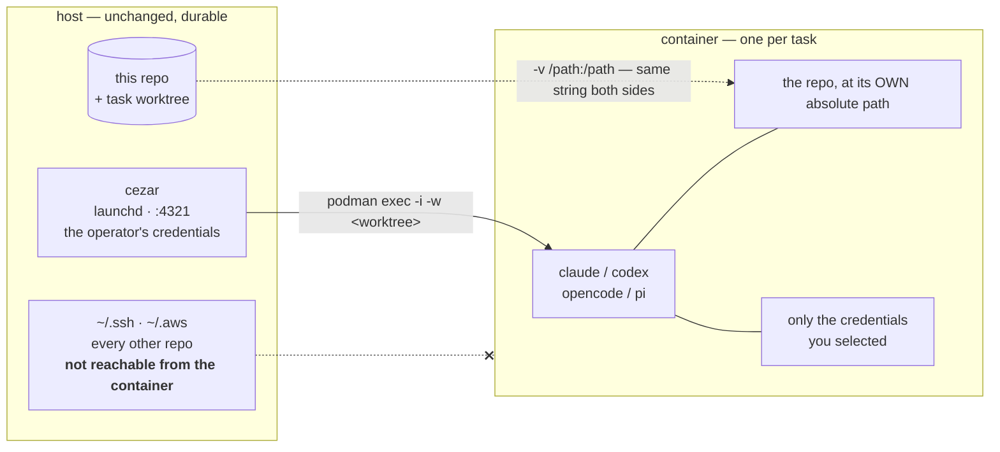
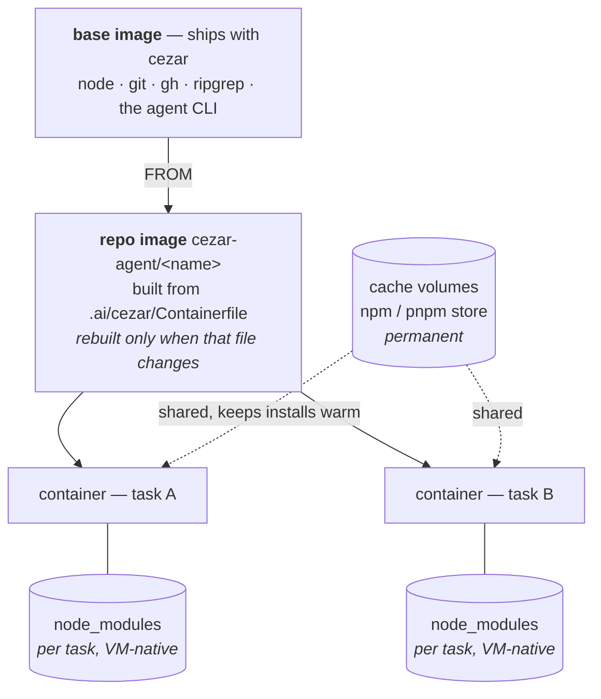

# Agent isolation: running tasks in containers

**Date:** 2026-09-07
**Status:** implemented (branch `feat/agent-isolation`)

## The problem

A cezar task hands a language model a shell with no meaningful boundary. `DEFAULT_ALLOWED_TOOLS`
includes `Bash` unrestricted, `--permission-mode dontAsk` means nothing is ever asked, and the
agent runs as the operator. Its blast radius is therefore the operator's entire machine: every
repo, `~/.ssh`, every cloud credential, every other project's `.env`.

The worktree is not a boundary. It scopes where the agent is *expected* to work, not what it *can*
reach — `cd ~` costs nothing.

So the practical ceiling on cezar today is trust. You give it the tasks you would be comfortable
running yourself, and the ones you would not, you do by hand. That ceiling is the feature.

## What ships

Each task's agent runs inside its own container. cezar stays on the host — durable, launchd-owned,
holding the operator's real credentials — and only the part that executes model-authored commands
is confined.



The dotted line that ends in a cross is the feature: everything else on the host stays out.

Opt-in per project, overridable per task, and off by default: an install that says nothing behaves
exactly as it always has.

## Design

### WHERE is not WHICH

Isolation is a `ProcessLauncher` injected into the runners, not a fifth `RunnerId`:

```ts
interface ProcessLauncher {
  spawn(bin, args, { cwd, env }): ChildProcessWithoutNullStreams
  signal(child, sig): Promise<void>
  readonly publishedPort?: number
}
```

`LocalLauncher` is today's behaviour; `PodmanLauncher` puts the identical argv inside a container.
Every backend gets isolation from one seam, and the four spawn sites were already the same shape.

Making it a runner id would have multiplied the matrix — `claude`, `claude-isolated`,
`codex`, `codex-isolated` — for two independent axes.

### Why podman, not Docker Sandboxes

We built `sbx` support first and abandoned it in practice. Its credentials live in an OAuth token
in the macOS keychain, so every `sbx` command needs a GUI (Aqua) security session — unusable from
ssh, which is how this machine is driven. It also stops a sandbox 30 s after the last session
disconnects, which makes a long-lived cockpit impossible. The `SbxLauncher` remains for hosts
already standardised on it.

Podman needs no account, no registry login and no keychain, and containers live exactly as long as
we say.

### The three-layer image model

"Each task must not start from a clean image" is the requirement. It is met by splitting lifetimes
rather than by keeping one container forever:

| Layer | Lifetime | Holds |
|---|---|---|
| **Base image** — ships with cezar | rebuilt on upgrade | node, git, gh, ripgrep, the agent CLI |
| **Repo image** `cezar-agent/<name>` | rebuilt when its Containerfile changes | that repo's toolchain |
| **Container** | per task | nothing that must survive |
| **Cache volumes** | permanent | package stores, so installs stay warm |
| **Ephemeral volumes** | per task | `node_modules` — VM-native speed, never on the host |

The expensive part (tools) is in an image, the slow part (packages) is in a volume, and only the
disposable part is per task.



A task's container lives as long as its worktree — both are the task's materialized state, so a
failed run keeps the environment its Continue will need.

### Learned Containerfiles

A repo with no image spends every task installing a toolchain. cezar watches the `Bash` calls its
agents make and proposes the system-wide installs as a Containerfile.

Two rules carry it. Only **system** installs count — a project's own `npm install` belongs to its
lockfile, and baking it in produces an image stale on the next dependency change. And nothing is
ever written unaccepted: a Containerfile assembled from whatever a model typed is not something to
write behind someone's back, so it is a proposal with the commands shown verbatim.

Accepting does **not** rebuild. The container that produced the suggestion already has those tools,
so the rebuild happens lazily before the next task, when `ensureImage` sees a Containerfile newer
than the image.

### Credentials

Isolation with no credentials is useless; with all of them it is pointless. So the dial is per
credential: a catalog (gh, git, ssh, gcloud, AWS, kube, registries, npm, PyPI) plus custom entries,
each on/off and each **mount** or **copy**.

- **mount** — the container reads the live file. Required for anything the tool refreshes in place;
  a cloud CLI rewrites its OAuth token and a copy goes stale. The cost is that the container can
  write it too.
- **copy** — a snapshot at container start. Nothing it does reaches the host's file. The cost is
  that a refresh inside does not persist.

Every entry is the credential **alone**, never a home directory — the same rule that mounts
`~/.claude/.credentials.json` rather than all of `~/.claude`, so the agent has a working login and
none of the operator's conversations.

### Honesty over convenience

Three decisions where the boring option would have been misleading:

1. **A container that cannot be prepared does not fail the run** — it runs locally and says so, in
   the run's own transcript, in those words. A hard failure would let a broken podman take the
   cockpit down; silence would run agents on the host while the config promised a sandbox.
2. **The composer shows `effective`, not `enabled`.** A chip reading "Isolated" while the container
   VM is stopped is a promise the run then has to retract.
3. **`createLauncher` returns the LOCAL launcher when podman is configured but no container was
   supplied.** It refuses to exec into nothing, and the run is unisolated and labelled, rather than
   appearing to work.

## What it cost to learn

Each of these was a failure first, and each is now a comment or a default in the code.

- **`ENOENT: no such file or directory, fstat`** on every run, with no stack and nothing under
  `--debug`. cezar points `TMPDIR` inside the repo (#785); in a container that is a host bind
  mount, and the native claude binary cannot do its startup temp-file work there. Bisected by
  holding argv, env and cwd identical and varying only `TMPDIR`. Container-local scratch is now
  forced by the launcher.
- **Killing an `exec` client does not kill the process inside** — measured with a `sleep` that
  outlived its client. Hence `signal()` on the seam, and a pid file the guest shell writes before
  `exec` replaces it.
- **A bind mount is ~15× slower** for metadata-heavy work (800 small file creates: 154 ms on the
  mount, 10 ms on a volume). Hence `ephemeralPaths`.
- **podman's default `/dev/shm` is 64 m**, which kills any headless browser and reports what looks
  like an out-of-memory error. Default is now 1 g.
- **A conversation is only findable by an agent running in the same home that wrote it.** Two
  tasks appeared lost this way — once when the cockpit moved out of a sandbox, once when the
  Continue path ran outside the container. Hence the agent's `~/.claude` is a host-mounted volume,
  and the isolation choice is persisted on the run so a Continue lands where the first turn did.
- **A container outlives its task unless every worktree-removal path removes it too.** Tying
  container lifetime to retention covered the common case and leaked one container per *deleted*
  task, because delete, "Remove worktree" and losing-variant cleanup each remove a worktree
  directly. The rule that holds is simpler than the mechanism: the container is the task's
  materialized state exactly as the worktree is, so it goes wherever the worktree goes.
- **A container removed on any terminal transition takes an hour of installed services with it** —
  and a failed run is exactly the one most likely to be continued. Container lifetime now follows
  worktree retention.

## Open questions for review

1. ~~**Default on or off for new projects?**~~ **Settled: configurable.** The machine decides, in
   Global settings → Resources, and a project that has chosen for itself is never overruled. Three
   states rather than two, because "no opinion" has to stay distinguishable from a deliberate
   *off* — collapsing them would let a machine default permanently overrule a project that opted
   out. Ships as no-opinion (off), so nothing changes for an existing install.
2. ~~**Should `sandbox.image` pinning stay?**~~ **Settled: it stays, but as a fallback rather than
   an override.** Precedence is now Containerfile → pin → base. A config key must not silently
   shadow a file sitting in the repo, which is exactly the footgun we hit: a project with a
   toolchain quietly running the generic base. A pin remains the way to point at a prebuilt image
   when there is no Containerfile to build from.
3. **Linux hosts.** Nothing has been run there. Two things are genuinely different rather than
   merely untested: containers run directly with no VM, so there is no VM allocation acting as the
   real memory ceiling and mounts are direct; and rootless podman maps the container's root onto a
   subuid, so files an agent writes into the bind-mounted repo can land owned by a uid the operator
   does not have — `--userns=keep-id` is the usual answer, and nothing here passes it. See
   Platforms.
4. ~~**Is `copy` worth its complexity?**~~ **Settled for now: mount is enough.** `copy` stays
   (it is written and tested, and is the right answer for a static key the container should not be
   able to write back) but nothing depends on it, and the catalog's defaults can move to mount
   wholesale if it proves to be dead weight.
5. **What is wired but never exercised.** claude has been run end to end in a container; codex,
   opencode and pi are wired through the same seam and have not been. Neither has the learned
   Containerfile round trip (observe → accept → rebuild), nor credential passthrough with a real
   credential selected. None of that is speculative work — it is untested work, which is a
   different thing to say out loud before review.

## Platforms

**macOS** — developed and exercised here. Containers run in a podman VM, so its allocation is the
real ceiling and container limits cap within it, not within the host's.

**Linux** — should work and is the simpler case (no VM, so installed means ready), but nothing has
been run there.

**Windows — refused, deliberately.** The design mounts the repo at its own absolute path so that
cwd, `--add-dir`, the worktree and `CEZ_HANDOFF_FILE` need no translation. `C:\Users\k\repo` is
not a path a Linux container can be given, so that property collapses and every mount and `-w`
built on it goes with it. The probe therefore reports Windows as unsupported up front rather than
letting `podman run` produce silently wrong mounts — a toggle that promises isolation and delivers
broken paths is worse than one that is not offered.

Supporting it means translating host paths to guest paths everywhere, which is precisely the class
of bug the same-path decision was made to avoid. It is doable; it is a different feature.

## Not in scope

Network egress policy (a container can still reach the internet), image signing/provenance, and
sharing one container across parallel variants of the same task.
